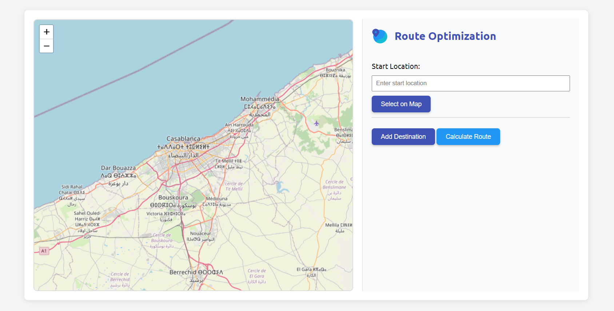
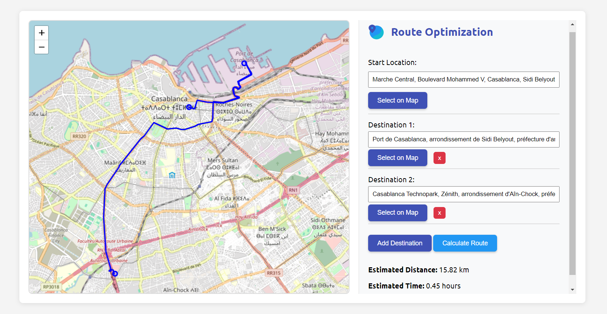
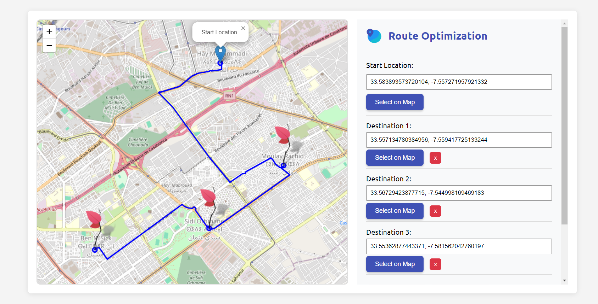

# Route Optimization App



A web-based route optimization app that uses **Leaflet.js** for map visualization and **OpenStreetMap** for map tiles. The app allows users to:
- Set a start location.
- Add multiple destinations.
- Calculate the optimal route using the **OSRM API**.

## Features
- **Interactive Map**: Users can click on the map to set the start location and destinations.
- **Route Calculation**: The app calculates the optimal route between the start location and destinations.
- **Custom Markers**: Different colored markers for the start location and destinations.
- **Responsive Design**: Works on both desktop and mobile devices.

## Technologies Used
- **Frontend**:
  - HTML, CSS, JavaScript
  - [Leaflet.js](https://leafletjs.com/) for map visualization
- **APIs**:
  - [OpenStreetMap](https://www.openstreetmap.org/) for map tiles
  - [OSRM](http://project-osrm.org/) for route optimization
  - [Nominatim](https://nominatim.openstreetmap.org/) for geocoding
  - [OpenCage Geocoder](https://opencagedata.com/) for geocoding (fallback)

## How to Use
1. **Set the Start Location**:
   - Enter the start location in the input field or click the "Select on Map" button to choose a location on the map.
2. **Add Destinations**:
   - Click the "Add Destination" button to add a new destination.
   - Enter the destination in the input field or click the "Select on Map" button to choose a location on the map.
3. **Calculate the Route**:
   - Click the "Calculate Route" button to calculate the optimal route.
   - The app will display the route on the map and show the estimated distance and time.

## Installation
To run this project locally, follow these steps:

1. **Clone the repository**:
   ```bash
   git clone https://github.com/your-username/route-optimization-app.git
   ```

2. **Navigate to the project directory**:
   ```bash
   cd route-optimization-app
   ```

3. **Open `index.html` in your browser**:
   Simply open the `index.html` file in your preferred browser.

## API Keys
This app uses the following APIs:

- **OpenCage Geocoder**: Requires an API key. You can get a free API key from [OpenCage](https://opencagedata.com/).
- **OSRM**: No API key required.

To use your own OpenCage API key, replace the `apiKey` variable in `js/app.js` with your API key:

```javascript
const apiKey = 'YOUR_OPENCAGE_API_KEY';
```

## Contributing
Contributions are welcome! If you'd like to contribute, please follow these steps:

1. **Fork the repository**.
2. **Create a new branch**:
   ```bash
   git checkout -b feature/YourFeatureName
   ```
3. **Commit your changes**:
   ```bash
   git commit -m "Add some feature"
   ```
4. **Push to the branch**:
   ```bash
   git push origin feature/YourFeatureName
   ```
5. **Open a pull request**.

## License
This project is licensed under the MIT License. See the `LICENSE` file for details.

## Acknowledgments
- **[Leaflet.js](https://leafletjs.com/)** for the mapping library.
- **[OpenStreetMap](https://www.openstreetmap.org/)** for providing free map tiles.
- **[OSRM](http://project-osrm.org/)** for the route optimization API.
- **[OpenCage](https://opencagedata.com/)** for the geocoding API.

## Screenshots




